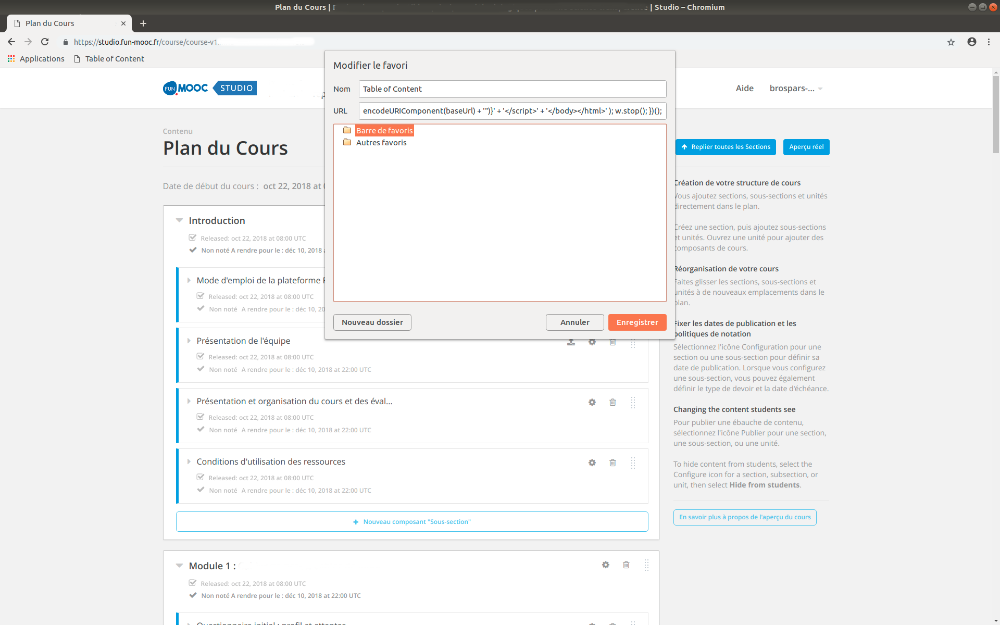
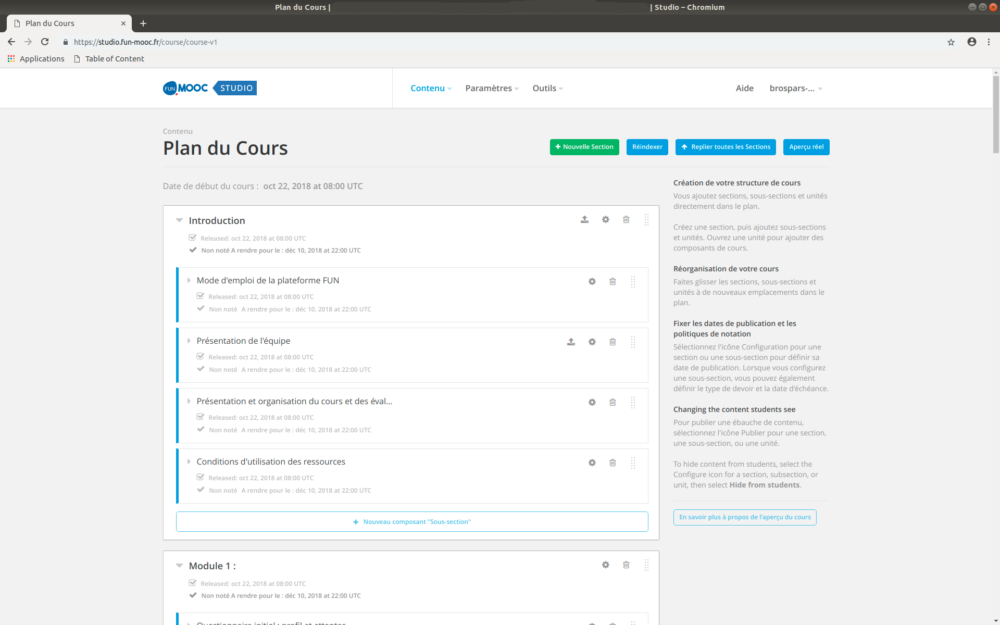
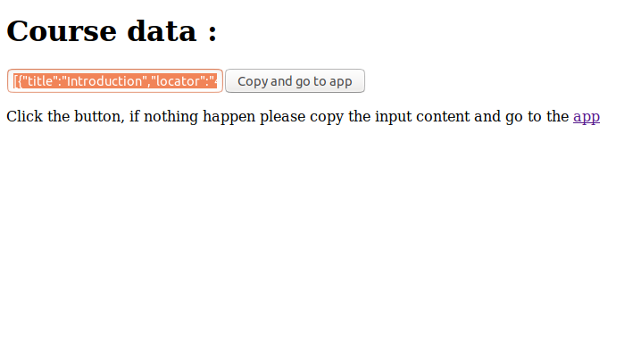
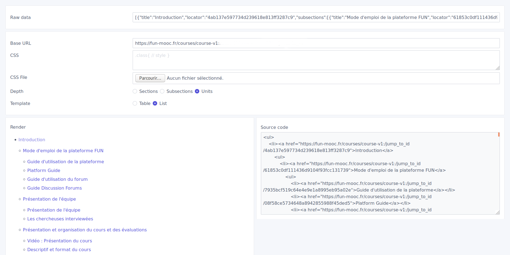

# Edx Studio Table of content

## How to use

1. Create a bookmark and paste the code from [here](public/bookmark.js)  

2. Go to the course homepage in studio (ex : https://studio.fun-mooc.fr/course/course-v1:xxxxxxxxxx)  

3. Run the bookmarklet by clicking it  

4. Click the button to copy and go to the app
5. Paste the data inside the "Raw data" field and you should get something like this :  



## Development

```
npm install
```

**Compiles and hot-reloads for development**
```
npm run serve
```

**Compiles and minifies for production**
```
npm run build
```

**Run your tests**
```
npm run test
```

**Lints and fixes files**
```
npm run lint
```
