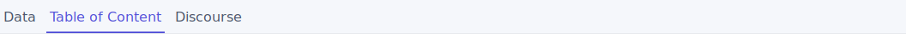
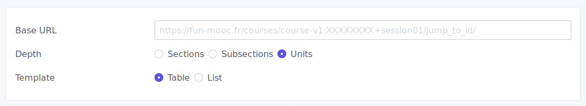
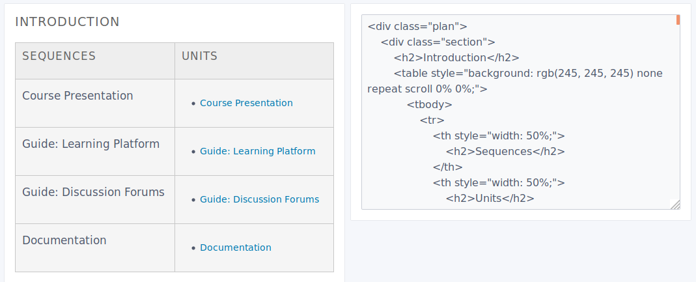
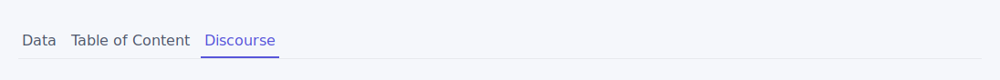
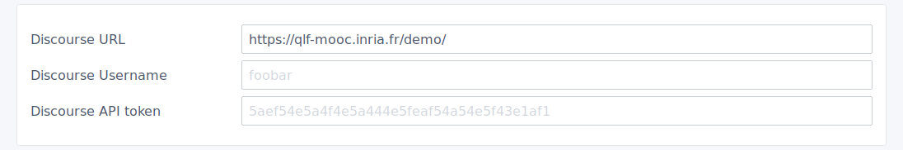
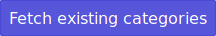
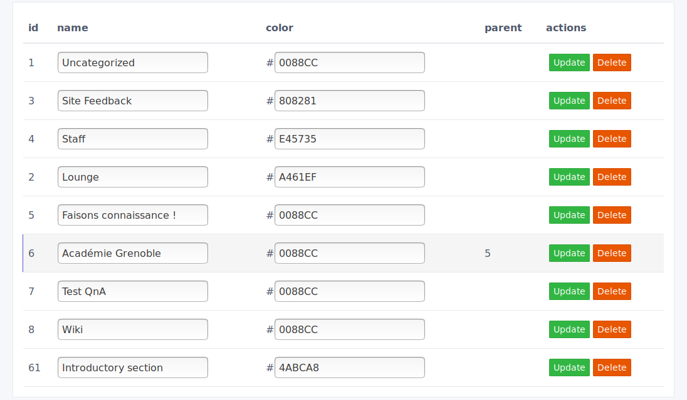
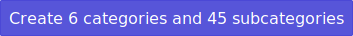

# Edx Studio Table of content

- [How to use](#how-to-use)
  * [Bookmarklet](#bookmarklet)
  * [Table of Contents](#table-of-contents)
  * [Discourse categories](#discourse-categories)
- [Development](#development)

## How to use

### Bookmarklet

1. Create a bookmark (right-click "add bookmark") and paste the code from [here](public/bookmark.js)  

2. Go to the course homepage in studio (ex : https://studio.fun-mooc.fr/course/course-v1:xxxxxxxxxx)  

3. Run the bookmarklet by clicking it  

4. Click the button to copy and go to the app
5. Paste the data inside the "Raw data" field

### Table of Contents

1. Go to the Table of contents tab

3. Select options (base url, depth, template, etc)

4. Check the preview

5. Copy code from the left panel

### Discourse categories

1. Go to the Discourse tab

2. Put Discourse options (API key are generated from Discourse Admin panel > API)

4. Check existing categories by clicking "Fetch existing categories"

5. Update or delete existing categories

6. Generate all categories and subcategories using "Create X categories and X subcategories"


## Development

```
npm install
```

**Compiles and hot-reloads for development**
```
npm run serve
```

**Compiles and minifies for production**
```
npm run build
```

**Run your tests**
```
npm run test
```

**Lints and fixes files**
```
npm run lint
```
